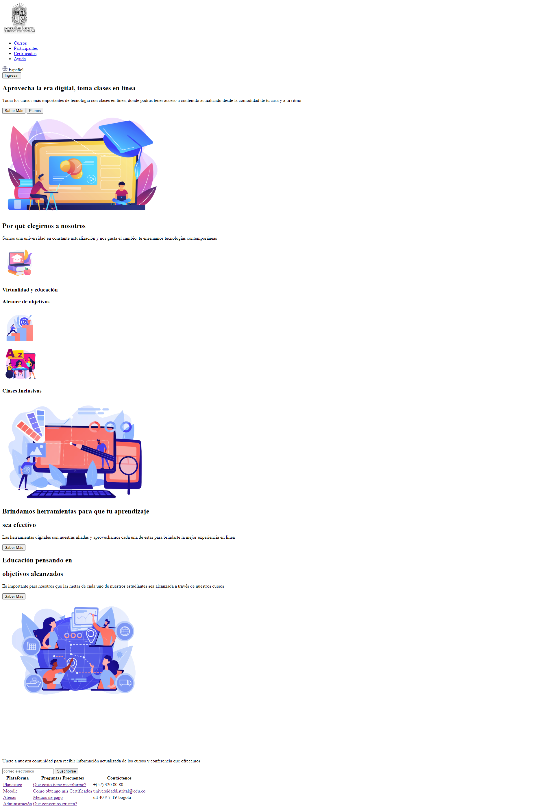

<h1>>Taller 9: Adriana Vasquez Varon</h1>

<h2>Información</h2>

Curso: Full Stack Basico - Grupo 1 

Profesor:Cristian Patiño 

<h2>Punto 1: Link de Figma</h2>
<a href="https://www.figma.com/file/t50EQq4W8LX5A4v9hlDj2U/Untitled?type=design&node-id=0-1&t=FVfcOMsBtum8kU4X-0">
Link Figma</a>

<h2>Punto 2: HTML </h2>

